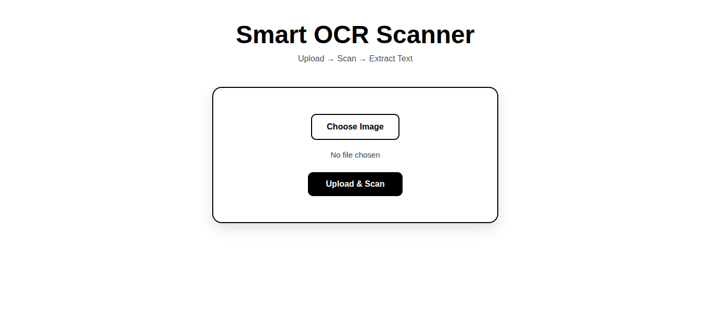
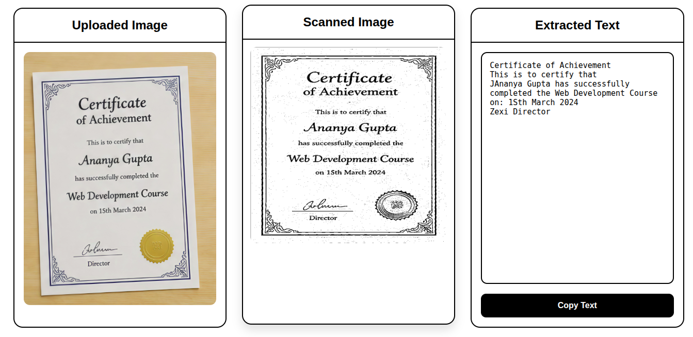

# Smart OCR Scanner and OCR System

A web-based OCR application built using OpenCV, EasyOCR, and Flask for scanning documents, correcting perspective distortion, and extracting editable text from images.

---

## Features

- Upload document images
- Automatic document boundary detection
- Perspective transformation for scanner-style output
- Image preprocessing using OpenCV
- OCR text extraction using EasyOCR
- Copyable extracted text output
- Simple and clean web interface

---

## Technologies Used

- Python
- OpenCV
- EasyOCR
- Flask
- NumPy
- HTML/CSS

---

## Project Workflow

Image Upload  
→ Document Detection  
→ Perspective Correction  
→ Image Preprocessing  
→ OCR Text Extraction  
→ Display Extracted Text

---

## Image Processing Techniques

- Grayscale Conversion
- Gaussian Blur
- Canny Edge Detection
- Contour Detection
- Perspective Transformation
- Adaptive Thresholding

---

## Installation

Clone the repository:

```bash
git clone https://github.com/YOUR_USERNAME/Smart-OCR-Scanner.git
```

Install dependencies:

```bash
pip install -r requirements.txt
```

Run the project:

```bash
python app.py
```

---

## Future Improvements

- Multi-language OCR
- PDF export
- Webcam document scanning
- OCR confidence filtering
- Handwritten text recognition

---

## Screenshots

### Home Page




---

### OCR Text Extraction



---

## Author

Manju Bhargav Ramisetty
